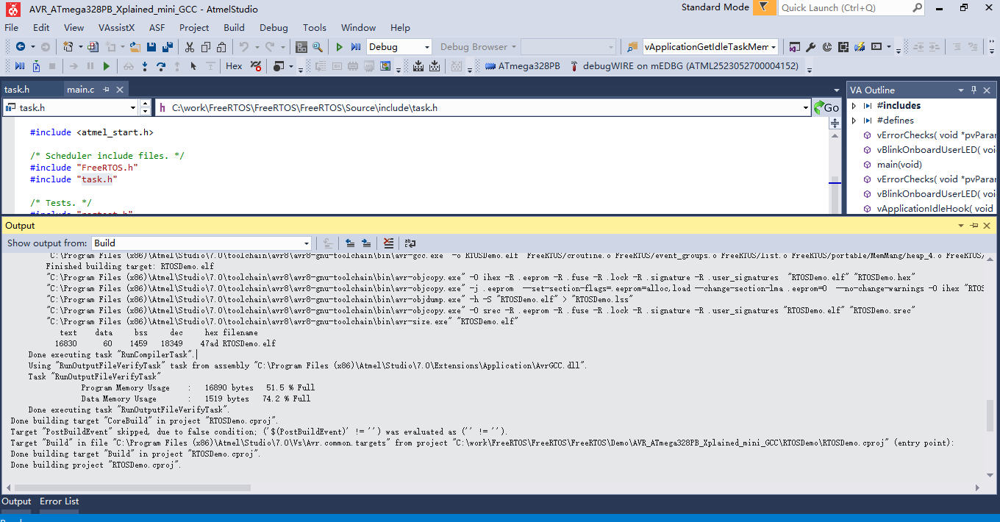
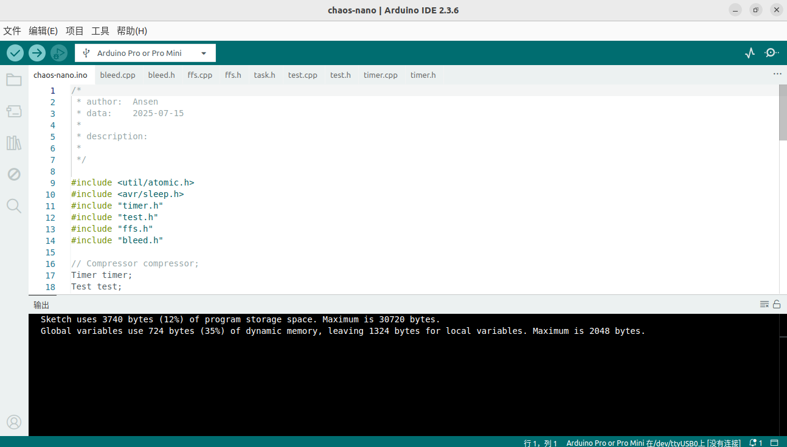

# Compare FreeRtos with chaos-nano

## Platform

`ATMEGA328P`

## Memory Occupancy

**`FreeRtos` **

**Analysis with the target device**

+ Flash capacity: 16,890 bytes are currently used, with a usage rate of 51.5%;
+ RAM capacity: Currently 1519 bytes used, 74.2% usage;

**`Chaos-nano` ** 

**Analysis with the target device**

+ Flash capacity: currently 3740 bytes are used, occupying only 12%;
+ RAM capacity: Currently 724 bytes are used, occupying only 35%;

## System Mechanics

**`FreeRtos` **

+ Lots of linked lists (dynamic memory)
+ One task stack per task
+ Preemptive
+ Actual hardware context switching is implemented by platform-specific assembly code (e.g. PendSV exception handling triggered by `portYIELD()`)
+ Context switching

**`Chaos-nano` ** 

+ Using static array instead of dynamic memory;
+ All tasks share a single stack
+ Non-preemptive
+ Without context switching
+ Platform-agnostic schedulers