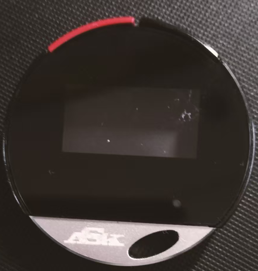
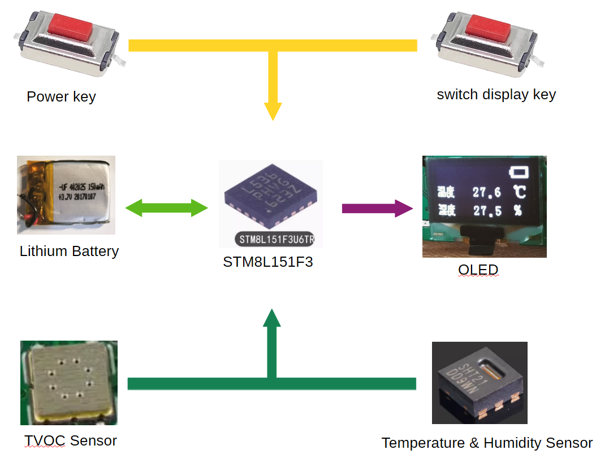
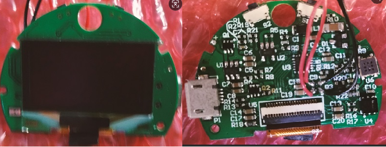

# Application of `Chaos-nano` in Handheld `VOC` Detection Devices

## Product Development Background

### Hazards of `VOC`

`VOC` (Volatile Organic Compounds) are organic chemical substances that easily volatilize at room temperature. They are widely present in indoor decoration materials (formaldehyde, benzene), furniture panels, automotive interiors, daily chemicals (cleaners, perfumes) and other scenarios, posing significant hazards to human health. **The hazards of VOC are particularly prominent for two special groups: the elderly and pregnant women**:

- Pregnant women: During pregnancy, immunity is relatively low. Long-term exposure to `VOC` may affect the normal development of the fetus, increasing the risk of fetal malformation, premature birth, and miscarriage. Among them, substances such as formaldehyde and benzene have been proven to have clear reproductive toxicity;
- The elderly: With declining physical functions, their respiratory system, cardiovascular system, liver and kidney functions are relatively weak. `VOC` stimulation can easily cause symptoms such as respiratory infections, dizziness, chest tightness, and blood pressure fluctuations. Long-term exposure may exacerbate chronic diseases (such as asthma, coronary heart disease).

In addition, `VOC` can also lead to a decline in indoor air quality, causing discomfort such as dry eyes and skin itching, and affecting the daily quality of life of special groups.

### Necessity of Product Development

With the improvement of residents' attention to health, the safety of the living environment for the elderly and pregnant women has become a core concern of families. However, traditional `VOC` detection has obvious pain points:

1. Professional testing institutions charge high service fees (several hundred to several thousand yuan per test) and have a long detection cycle, which cannot meet the needs of daily high-frequency monitoring;
2. Large laboratory instruments are bulky and complex to operate, making it difficult for the elderly and pregnant women to use independently, let alone carry them around;
3. Most ordinary household testing tools have a short battery life and cannot support long-term outdoor testing;

To meet the usage needs of the elderly and pregnant women, a portable `VOC` detection device with long working hours is required; at the same time, it needs to have core characteristics such as **extremely simple operation, intuitive data, and safety without radiation**. Based on this idea, the development of a handheld `VOC` detection device for the elderly and pregnant women has strong practical necessity and social value.

## Product Introduction



The product takes "ultimate portability + long battery life" as its core design goals:

- To meet portability requirements, a circular design with a diameter of 4 cm is adopted in the appearance design;
- To enable long-term operation, the low-power 8-bit microcontroller `STM8L151F3` is selected for component selection, and the `Chaos-nano` operating system is adopted in the system software design——this system is a lightweight asynchronous cooperative operating system that can block tasks when they are not executing and enter a low-power state when appropriate——further reducing the product's power consumption.

### Product Structure

The handheld `VOC` detection device is built based on the `Chaos-nano` operating system and `STM8L151F3` chip. Targeting the usage habits of the elderly and pregnant women, it adopts a modular structure of "minimalist design + core function focus". The core components include:

**1. Hardware Layer:**

   - Control Core: `STM8L151F3` microcontroller (compact package to reduce device size);
   - Sensing Module: High-precision and low-power `VOC` sensor, temperature and humidity sensor SHT21;
   - Display Module: 0.95-inch `OLED` display screen;
   - Operation Module: One-key operation buttons (only 2 core buttons are retained: power on/wake-up and display switch to simplify operation);
   - Power Module: Limited by the product size, the product adopts a `150 mAh` battery and a `usb-micro` interface (supports 5V charging, compatible with commonly used household chargers);
**2. System Layer**: Equipped with the `Chaos-nano` operating system, it provides core functions such as lightweight task scheduling, interrupt handling, and low-power management. It adapts to the hardware resource constraints of `STM8L151F3` to ensure stable device operation and long battery life.
**3. Application Layer**: Focusing on the core needs of the elderly and pregnant women, it includes functional modules such as **rapid detection, accurate data display, safety alarm, and one-key calibration**, simplifying redundant operations. At the same time, through in-depth power consumption optimization, it ensures that the `150 mAh` battery can support continuous operation for more than 8 hours.

### Core Advantage: Ultimate Portability Design

Relying on the compact `150 mAh` lithium battery, the small package of the `STM8L151F3` chip, and the lightweight `Chaos-nano` operating system, the device achieves "pocket-level portability":

- Size: 40 mm × 40 mm × 10 mm, with a keyhole for easy carrying by the elderly and pregnant women in pockets, handbags, or hanging on the body, with almost no carrying burden;
- Material: The shell is made of ABS plastic with anti-slip treatment on the surface, providing a comfortable hand feel and easy grip; the corners are rounded without edges and corners to avoid collision damage; combined with aluminum alloy blocks, the overall appearance is not monotonous;
- Battery Life Adaptation: The `usb-micro` interface supports multiple charging methods such as power banks, mobile phone chargers, and computer USB ports. It can be recharged at any time when going out. Combined with the ability to work continuously for more than 8 hours, it meets the needs of all-day outdoor detection (such as medical visits, shopping, visiting relatives and friends, etc.).

### Core Chip: Detailed Introduction to `STM8L151F3`

`STM8L151F3` is an ultra-low-power 8-bit microcontroller launched by STMicroelectronics. Based on the `STM8` core architecture, it is specially designed for battery-powered portable smart devices. Its characteristics are highly compatible with the product positioning of "150 mAh battery + 8-hour battery life" and the usage needs of the elderly and pregnant women, making it an ideal control core for the device:

- **Core and Frequency**: Adopts the `STM8` enhanced core, with a maximum operating frequency of 16 MHz, supporting 16-bit multiplication instructions and hardware division. It has high instruction execution efficiency and can quickly respond to real-time tasks such as sensor data collection and key operations, ensuring that the device "starts testing immediately and outputs data in seconds" without the elderly and pregnant women having to wait for a long time.
- **Storage Resources**: Built-in 8 KB Flash and 1 KB RAM, perfectly matching the lightweight design of the `Chaos-nano` operating system——the core only occupies more than 500 bytes of RAM, and the remaining memory can fully support core functions such as sensor data processing and alarm logic. No additional expansion of storage chips is required, which not only reduces the device size and cost but also reduces the risk of failure.
- Operating Mode (Continuous Detection State): The chip's own power consumption is only 240 μA/MHz (about 3.8 mA) at 16 MHz frequency;
- `STM8L151F3` integrates a variety of practical peripherals, eliminating the need for additional expansion chips, which not only simplifies the device structure, reduces the size but also lowers power consumption;
- The chip has a compact package (UFQFPN20 package, size 4 mm × 4 mm), which can greatly reduce the device size and provide a hardware foundation for the compact layout of the 150 `mAh` battery.

### Overall System Framework






The system adopts a three-layer architecture of "hardware driver - operating system - application layer":

1. **Bottom Driver Layer**: Composed of the `STM8L15x_StdPeriph_Driver` driver library and custom device drivers, it realizes the underlying control of `STM8L151F3` chip peripherals (`ADC`, `I2C`, `GPIO`, etc.) and hardware such as `VOC` sensors, display modules, and keys. It focuses on optimizing low-power driver logic and data collection accuracy, corresponding to the `devices` directory in the code and the interrupt processing files `stm8l15x_it.c`/`stm8l15x_it.h`.

2. **Operating System Layer**: That is, the `Chaos-nano` kernel (`kernel` directory), which is responsible for task scheduling (such as priority management of "collection-processing-display" tasks) and low-power management (core function). Through streamlined design, it ensures efficient operation in the 1 KB RAM of `STM8L151F3`, and optimizes task switching delay and power consumption control strategies to balance battery life and response speed.

3. **Application Layer:** Optimizes core logic, including:

- Fast sensor collection (`handle.c`/`handle.h`);
- Intuitive data display;
- Simplified operation logic (only 2 keys, automatic detection after power-on, automatic sleep without operation);

## Product System Implementation Analysis

### Workflow

- After pressing the power button, the system initializes and starts the power button detection task. When it detects that the power button is pressed continuously for 3 seconds, it sets the power on and displays the first screen content;
- After pressing the screen switch button:
  - The corresponding interrupt is triggered, and the screen switch task is started in the interrupt;
  - After returning from the interrupt, the scheduler prioritizes the screen switch task;
  - The display content is switched in the screen switch task;
- After power-on, the system collects data with a certain delay:
  - Starts the temperature and humidity task every 1 second to collect temperature and humidity once, and refreshes the display after collecting data;
  - Starts the `VOC` task every 1 second to collect `VOC` data once, and refreshes the display after collecting data;
  - Starts the battery task every 2 seconds to collect the battery level and charging status, then refreshes the display;
- Display Refresh:
  - No separate task is set for display refresh, so display refresh is a synchronous operation——no separate task is used for asynchronous display refresh;
  - Global flags are used to determine which screen is currently displayed. When the content of the current screen needs to be refreshed, the screen is refreshed; otherwise, it returns directly;
  - The battery icon is displayed on each screen, so when battery data needs to be refreshed, this part of the display is refreshed in a timely manner;

## Software Implementation

### Task Classification and Priority Setting

The software is developed based on the `IAR for STM8` development environment, combined with the `Chaos-nano` operating system, and adopts a "task-oriented" design, decomposing functions into 5 independent tasks:

- Power button detection task;
- Screen switch button detection task;
- Temperature and humidity (SHT21) detection task;
- `VOC` detection task;
- Battery status and level detection task;

Efficient collaborative work is achieved through priority-based scheduling.

| Task ID       | Task Name                          | Core Function                                                | Priority | Trigger Mode |
| ------------- | ---------------------------------- | ------------------------------------------------------------ | -------- | ------------ |
| TASK_ID_POWER | Power Button Detection             | Detect whether the power button is pressed and held for the specified time | 0        | Interrupt    |
| TASK_ID_KEY   | Screen Switch Button Detection     | Switch display screens                                       | 1        | Interrupt    |
| TASK_ID_SHT21 | Temperature and Humidity Detection | Obtain temperature and humidity detection data               | 2        | Timer        |
| TASK_ID_TVOC  | `VOC` Detection                    | Obtain `VOC` detection data                                  | 3        | Timer        |
| TASK_ID_BAT   | Battery Detection                  | Detect the battery's charging status and level               | 4        | Timer        |

### Core Task Code Logic Analysis

- Main Scheduling Logic

The main function implements task scheduling through a loop of "obtain the next high-priority task → execute the task → reset the state". The core logic is as follows:

```c
void start_kernel(void)
{
  board_init();
  
  task_init();
  time_init();
  
  device_on();
  
  while (1)
  {
    switch (task_getNextPriority())
    {
    case TASK_ID_POWER:
      powerOnHandle();
      break;
      
    case TASK_ID_KEY:
      keyHandle();
      break;
      
    case TASK_ID_SHT21:
      Get_TempHum();
      break;
      
    case TASK_ID_TVOC:
      Get_Tvoc();
      break;
      
    case TASK_ID_BAT:
      Check_Charge_Bat();
      break;
      
    case TASK_ID_DISP:
      //bat_pic(3,50, pow_bat[1]);
      break;
      
    default:
      task_restoreAll();
      if (IDLE_PRI == task_getNextPriority())
      {
        sleep_cpu();
      }
      break;
    }
  }
}
```

- Power Button Detection：

When the power button is pressed, the `TASK_ID_POWER` task is triggered through an interrupt.

  - If pressed when the power is off: In this task, it will delay for 3 seconds and then judge again whether the button is pressed and held. If the button is pressed and held, the corresponding pins and flags will be set;
  - If pressed when the power is on: In this task, it will delay for 5 seconds and then judge again whether the button is pressed and held. If the button is pressed and held, the corresponding pins and flags will be set;

```c
void powerOnHandle(void)
{
  static bool flag = false;
  
  if(!powerOn){
    if(!flag){
      if(GPIO_ReadInputDataBit(GPIOA,GPIO_Pin_3)!=RESET) {
        time_create(TASK_ID_POWER, 3000, &flag, true);
      } else {
        time_cancel(TASK_ID_POWER);
      }
    } else {
      if(GPIO_ReadInputDataBit(GPIOA,GPIO_Pin_3)!=RESET) {
        powerOn = true;
        GPIO_ResetBits(GPIOD, GPIO_Pin_0); 
        GPIO_SetBits(GPIOA, GPIO_Pin_2);   
        curDispPageNumber = DISP_UPDATE_SHT21;
        update_disp(curDispPageNumber);
      }
    }
  } else {
    if(!flag){
      if(GPIO_ReadInputDataBit(GPIOA,GPIO_Pin_3)!=RESET) {
        time_create(TASK_ID_POWER, 5000, &flag, true);
      } else {
        time_cancel(TASK_ID_POWER);
      }
    } else {
      if(GPIO_ReadInputDataBit(GPIOA,GPIO_Pin_3)!=RESET) {
        powerOn = false;
        GPIO_SetBits(GPIOD, GPIO_Pin_0);          
        GPIO_ResetBits(GPIOA, GPIO_Pin_2);        
        curDispPageNumber = DISP_UPDATE_POWER_OFF;
        update_disp(curDispPageNumber);
      }
    }
  }
  
  task_setBlock(TASK_ID_POWER);
  flag = false;
  
  return;
}
```

- Temperature Detection Task

When the temperature and humidity sensor is initialized, a timer is started. When the timer expires, the `TASK_ID_SHT21` task is triggered. In this task, temperature and humidity data are obtained from SHT21 through `IIC`, the screen display is updated, and the next delay is started.

```c
void Get_TempHum(void)
{
  if(flag){
    flag = false;
    Get_TempHum_1();
    update_disp(DISP_UPDATE_SHT21);
    time_create(TASK_ID_SHT21, DELAY_MS, &flag, true);
  }
  
  task_setBlock(TASK_ID_SHT21);
}
```


## Advantages Brought by `Chaos-nano` in Development

Due to the use of an 8-bit microcontroller, the product initially adopted a traditional software development method; after the `Chaos-nano` operating system was developed, the project was reconstructed using the `Chaos-nano` operating system.

### Comparison of Old and New Software Codes

- The following code is the key processing part in the traditional mode development:

```c
void KeyHandle()
{
  OLED_CLS();
  while(1)
  {
    if(Sleeping==0){
      if(PowerStatus==ENABLE) //Indicates power on
      {
        Delay(3000);
        Check_Charge_Bat();
        Dis_Bat();
        if(page_nums==0)  {//Display temperature
          my_page = 3;
          Delay(1000);
          
          if(FlagChange == ENABLE) //Press S2 to turn the page
          {
            page_nums=1;
            OLED_CLS();
            Dis_Uin();
            FlagChange=DISABLE;
          }
          Get_TempHum();
          Check_Charge_Bat();
          Dis_Bat();
          //OLED display
          Dis_Data(page_nums);
          
        }else if(page_nums==1)  {//Display RH
          my_page = 0;
          Delay(1000);
          if(FlagChange == ENABLE)
          {
            page_nums=2;
            OLED_CLS();
            Check_Charge_Bat();
            FlagChange=DISABLE;
          }
          Get_TempHum();
          Check_Charge_Bat();
          //OLED display
          Dis_Data(page_nums);
          
        }else if(page_nums==3)  {//Display TVOC
          my_page = 2;
          Delay(1000);
          if(FlagChange == ENABLE)
          {
            page_nums=0;
            OLED_CLS();
            FlagChange=DISABLE;
          }
          Get_Tvoc();
          //OLED display
          Dis_Data(page_nums);
          
        }else if(page_nums==2) {//Display OC2
          my_page = 1;
          Delay(1000);
          if(FlagChange == ENABLE)
          {
            page_nums=3;
            OLED_CLS();
            Check_Charge_Bat();
            FlagChange=DISABLE;
          }
          Check_Charge_Bat();
          Get_Tvoc();
          //OLED display
          Dis_Data(page_nums);
        }
      } else if(PowerStatus==DISABLE)//Shut down in charging state
      {
        Delay(3000);
        if(FlagS==ENABLE){
          FlagChange=DISABLE;
          page_nums=0;
          FlagS=DISABLE;
          //Turn off OLED screen	
          OLED_CLS();
        }
      }
      
    }
    ScreenDispose();
    
  }
}
```

- Code after using the `Chaos-nano` operating system

```c
void keyHandle(void)
{
  if(!powerOn)
    return;
  
  curDispPageNumber = (curDispPageNumber == DISP_UPDATE_SHT21) ? DISP_UPDATE_TVOC : DISP_UPDATE_SHT21;
  OLED_CLS();
  update_disp(DISP_UPDATE_BAT);
  update_disp(curDispPageNumber);
  
  task_setBlock(TASK_ID_KEY);
}

void update_disp(enum disp_update_t disp_update_number)
{
  switch(disp_update_number){
  case DISP_UPDATE_SHT21:
    {
      if(disp_update_number != curDispPageNumber)
        return;
      
      //Display temperature and humidity
      ... ...
    }
    break;
    
  case DISP_UPDATE_TVOC:
    {
      uint16_t Tvocmg_L = 0;
      uint16_t eCO2PPM = 0;
      
      if(disp_update_number != curDispPageNumber)
        return;
      
      //Display formaldehyde and air quality
      ... ...
    }
    break;
    
  case DISP_UPDATE_BAT:
    {
      if( (curDispPageNumber == DISP_UPDATE_SHT21) || (curDispPageNumber == DISP_UPDATE_TVOC) ){
        Dis_Bat(true);
      } else {
        Dis_Bat(false);
      }
    }
    break;
    
  case DISP_UPDATE_POWER_OFF:
    {
      OLED_CLS();
      Dis_Bat(true);
    }
    break;
  }
}
```


### Problems Caused by Traditional Development Modes:

- Redundant Logic and High Coupling
- The code "stacks" functions such as key detection, page switching, data collection (temperature and humidity, TVOC), OLED display, and battery detection in an infinite loop, with blurred boundaries between module responsibilities. For example, the key page turning logic is strongly bound to the `page_nums` variable, and data collection functions (`Get_TempHum()`, `Get_Tvoc()`) are directly embedded in page judgment branches. If a new "separate formaldehyde concentration display" page needs to be added, the entire loop structure and multiple judgment conditions need to be modified, which affects the whole body.
- It relies on global variables such as `Sleeping`, `PowerStatus`, and `FlagChange` for state control. The state flow of variables is opaque. When troubleshooting problems, it is necessary to trace the entire code flow, resulting in high maintenance costs.
- Blocking Design Affects User Experience
- A large number of blocking delay functions such as `Delay(1000)` and `Delay(3000)` are used in the code, during which the CPU cannot respond to other operations. For users, after pressing a key, it may take 1-3 seconds to complete page switching, resulting in poor operation fluency; if another key is triggered during the delay (such as accidental touch), the device does not respond at all, which is likely to cause the misunderstanding of "device failure".
- The infinite loop `while(1)` occupies all CPU resources. Even when the device is in an idle state, it cannot enter the low-power mode, directly leading to a significant reduction in battery life and making it difficult to meet the product requirement of long working hours.
- Poor Scalability and High Cost of Adapting to Requirement Changes
- The page switching logic is implemented through multi-branch `if-else` of `page_nums`. If new detection parameters need to be added (such as adding PM2.5 display in addition to temperature and humidity and TVOC), it is necessary to add `page_nums` enumeration values, extend judgment branches, and modify page turning logic. The code volume increases linearly, and it is easy to introduce logical errors.
- Key processing is deeply coupled with display and data collection. If it is necessary to optimize the operation logic (such as "long-press key to lock data"), new judgment conditions need to be inserted into the lengthy loop, destroying the original code structure.

### Code Advantages After Using the `Chaos-nano` Operating System

- Modular Splitting with Clear and Single Responsibilities
  - The original code is split into two independent modules: "key processing (`keyHandle()`) and "display update (`update_disp()`)". Keys are only responsible for triggering page switching, display is only responsible for updating content according to page type, and data collection can be independently encapsulated as tasks. Each module communicates through the `curDispPageNumber` enumeration variable, with clear responsibility boundaries.
  - The enumeration `enum disp_update_t` is used to define display types (`DISP_UPDATE_SHT21`, `DISP_UPDATE_TVOC`, etc.). When adding a new page, only the enumeration value and the `switch` branch in `update_disp()` need to be extended, without modifying the key processing logic, resulting in strong scalability. For example, to add a "formaldehyde display" page, only the `DISP_UPDATE_FORMALDEHYDE` enumeration item and the corresponding display branch need to be added, with a code change of less than 10 lines.
- Non-blocking Design to Adapt to the Operation Needs of Special Groups
  - Blocking delays are completely abandoned, and asynchronous processing is realized with the help of the task scheduling mechanism of `Chaos-nano`. After the key is pressed, `keyHandle()` only completes the core logic of "page number switching → triggering display update → task blocking" without waiting; time-consuming operations such as data collection and OLED refresh can be executed asynchronously by independent tasks. After the user presses the key, the page switches instantly without delay, providing a smoother operation experience.
  - The key task is blocked by the `task_setBlock(TASK_ID_KEY)` function to avoid repeated triggering in a short time, and at the same time, CPU resources are released for other tasks (such as low-power management, data calibration). Combined with the low-power scheduling of `Chaos-nano`, the device can quickly enter the sleep mode when there is no operation, maximizing the battery life.
- Transparent State Management and Greatly Improved Maintenance Efficiency
  - The page state is uniformly managed through the `curDispPageNumber` enumeration variable, with a clear value range (only corresponding to the defined display types), avoiding the problem of chaotic global variable states in bare-metal code. For example, the `update_disp()` function directly locates the display logic by judging the enumeration value, without tracing the modification records of global variables.
  - The logical branches are simplified from 4 `if-else` to 1 `switch` statement, with extremely high readability. Developers can quickly locate problems or extend functions without understanding complex loop nesting and delay logic, significantly shortening the product iteration cycle.
- Low-Coupling Design to Adapt to Product Function Iteration
  - Key processing is completely decoupled from data collection and display logic. If it is necessary to optimize the user experience (such as "display TVOC concentration by default to reduce page turning operations"), only the initial value of `curDispPageNumber` needs to be modified; if it is necessary to adjust the battery display logic, only the `DISP_UPDATE_BAT` branch in `update_disp()` needs to be modified, without affecting other functional modules.
  - Relying on the task management capability of `Chaos-nano`, independent tasks (such as "low battery alarm", "one-key calibration") can be easily added without worrying about conflicts with the original key and display logic. For example, when adding a "calibration task", only a new task needs to be created and the code for the new function added, and the original code does not need to be modified.

## Summary of Core Values Brought by `Chaos-nano`

For this project, `Chaos-nano` not only "makes the code more concise" but also achieves three core values through architectural innovation:

### 1. Improve Product Usability

The non-blocking design eliminates the delay in key operations, and the modular logic ensures the stability of device operation, fully meeting the core needs of the elderly and pregnant women for "one-key operation and immediate response" and reducing the use threshold for special groups.

### 2. Reduce Development and Maintenance Costs and Accelerate Product Iteration

The concise code structure and clear module division allow developers to sort out logical relationships without spending a lot of time. When adding new functions or modifying requirements, the code change is reduced by more than 60%, significantly shortening the product development cycle and maintenance costs.

### 3. Release Hardware Potential and Ensure Core Product Features

The low-power scheduling mechanism of `Chaos-nano`, combined with the non-blocking code design, ensures that the device is small in size and light in weight, perfectly realizing the product positioning of "ultimate portability + long battery life".


In summary, through the architectural reconstruction of traditional bare-metal code, the `Chaos-nano` operating system solves the pain points such as redundant logic, high coupling, and poor scalability, and provides the development team with an efficient and flexible development framework, becoming an important support for the product's core competitiveness.


## Product Video

<div align="center">
  
</div>